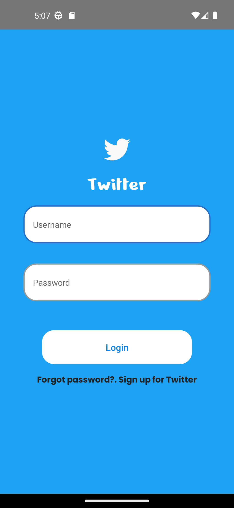
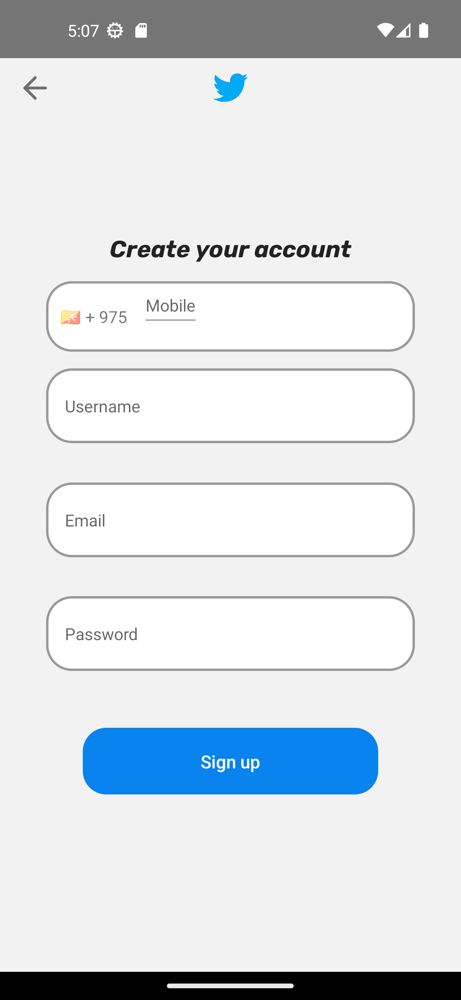
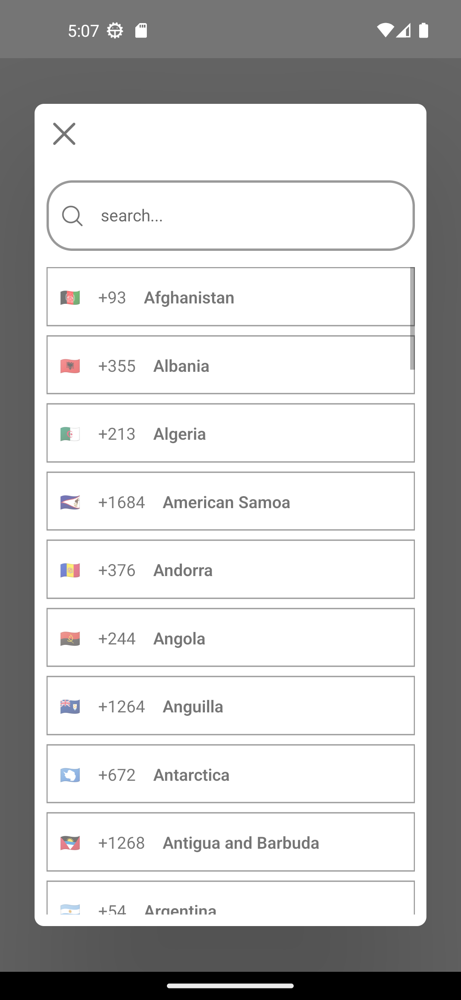

# TwitterAuth 
This is just like a authentication blueprint of ***twitter***. This project builded for my learning journey, and i just want to know how react-native navigation, async storage works. Total 3 pages are created on this project ***Home***, ***Login***, ***SignUp***. Image and text data used in unsplash api and regex used for user input checking.
## Preview

## Technologies
1. React-native
   1. babel-plugin-module-resolver 
   2. react-native-vector-icons
   3. prop-types
   4. axios
   5. react-navigation/stack
   6. @react-native-async-storage/async-storage
2. Google fonts
3. Unsplash api (photo gallery api)

## helped sources
- [country code](https://www.naroju.com/create-your-own-phone-number-input-in-react-native/)
- [axios](https://blog.logrocket.com/using-axios-react-native-manage-api-requests/)
- [pointerEvent](https://blog.logrocket.com/using-pointerevents-react-native/)
- [react-navigation](https://reactnavigation.org/docs/stack-navigator/)
- [boot-splash](https://github.com/zoontek/react-native-bootsplash)
